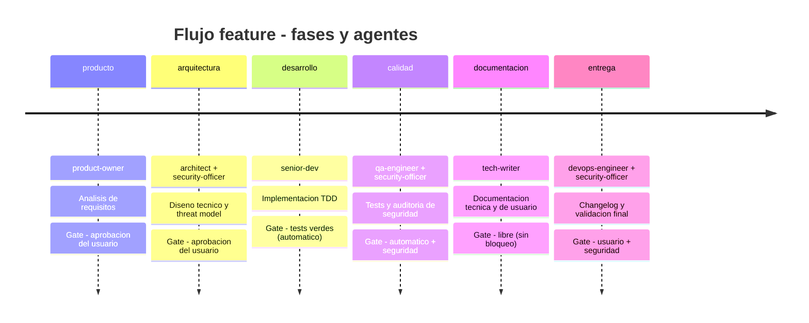

# El equipo

Alfred Dev no es un agente monolitico que intenta saberlo todo y hacerlo todo. Es un equipo de **15 especialistas**, cada uno con un rol delimitado, herramientas restringidas, personalidad propia y quality gates infranqueables. Esta decision de diseno responde a un principio fundamental: un modelo de IA generalista rinde mejor cuando se le asigna un rol concreto con instrucciones focalizadas que cuando se le pide que sea todo a la vez.

Cada agente se invoca como un subproceso de Claude Code mediante la herramienta **Task**. Esto garantiza aislamiento de contexto: el agente arranca con su propio system prompt, sin heredar sesgos ni ruido de conversaciones anteriores. El resultado es previsible y reproducible: el mismo agente, ante la misma entrada, produce resultados consistentes porque no arrastra el contexto acumulado de la sesion.

La filosofia detras de esta arquitectura se puede resumir en tres principios:

- **Responsabilidad unica.** Cada agente tiene un ambito de actuacion claro. El Artesano escribe codigo; El Paranoico audita seguridad. Ninguno invade el territorio del otro.
- **Herramientas restringidas.** No todos los agentes necesitan acceso al sistema de ficheros o a la terminal. Limitar las herramientas por agente reduce la superficie de error y fuerza la especializacion.
- **Quality gates entre fases.** Ningun artefacto pasa de una fase a la siguiente sin superar un punto de control. Estos gates pueden ser automaticos (tests verdes), manuales (aprobacion del usuario) o combinados (automatico + seguridad).

---

## Flujo feature: cronologia de fases

El flujo `feature` es el mas completo del sistema y el que mejor ilustra como colaboran los agentes. Cada feature nueva atraviesa seis fases secuenciales, y en cada fase intervienen agentes especificos. El security-officer aparece en tres fases distintas porque la seguridad no es un paso final sino una preocupacion transversal que acompana al desarrollo desde el diseno hasta la entrega.

El diagrama muestra algo importante: la seguridad no se comprueba al final, sino que interviene en la arquitectura (para validar el threat model), en la calidad (para auditar el codigo) y en la entrega (para dar el visto bueno final). Esta presencia transversal del security-officer es una decision deliberada para que los problemas de seguridad se detecten lo antes posible, cuando corregirlos es barato.

---

## Tabla resumen de agentes

Los 15 agentes se dividen en dos categorias: nucleo y opcionales. La tabla siguiente ofrece una vision rapida de cada uno con sus caracteristicas principales.

### Agentes de nucleo

Estos ocho agentes estan siempre activos y forman la espina dorsal del sistema. No se pueden desactivar.

| Agente | Alias | Modelo | Tipo | Color | Fase principal |
|--------|-------|--------|------|-------|----------------|
| `alfred` | Alfred | opus | nucleo | azul | orquestacion |
| `product-owner` | El Buscador de Problemas | opus | nucleo | verde | producto |
| `architect` | El Dibujante de Cajas | opus | nucleo | cyan | arquitectura |
| `senior-dev` | El Artesano | opus | nucleo | amarillo | desarrollo |
| `security-officer` | El Paranoico | opus | nucleo | rojo | seguridad (transversal) |
| `qa-engineer` | El Rompe-cosas | sonnet | nucleo | magenta | calidad |
| `devops-engineer` | El Fontanero | sonnet | nucleo | naranja | entrega |
| `tech-writer` | El Traductor | sonnet | nucleo | blanco | documentacion |

### Agentes opcionales

Estos siete agentes cubren necesidades especificas que no todos los proyectos tienen. Se activan por configuracion.

| Agente | Alias | Modelo | Tipo | Color | Fase principal |
|--------|-------|--------|------|-------|----------------|
| `data-engineer` | El Fontanero de Datos | sonnet | opcional | cyan | datos |
| `ux-reviewer` | El Abogado del Usuario | sonnet | opcional | rosa | UX |
| `performance-engineer` | El Cronometro | sonnet | opcional | amarillo | rendimiento |
| `github-manager` | El Conserje del Repo | sonnet | opcional | gris | GitHub |
| `seo-specialist` | El Rastreador | sonnet | opcional | verde | SEO |
| `copywriter` | El Pluma | sonnet | opcional | magenta | contenido |
| `librarian` | El Bibliotecario | sonnet | opcional | ambar | memoria |

---

## Nucleo vs opcionales

La distincion entre agentes de nucleo y opcionales no es arbitraria. Responde a una pregunta practica: que necesita *cualquier* proyecto de software, y que solo necesitan *algunos* proyectos.

Los **ocho agentes de nucleo** estan siempre activos porque cubren las fases universales del desarrollo: definir que se construye (product-owner), decidir como se construye (architect), construirlo (senior-dev), verificar que funciona (qa-engineer), documentarlo (tech-writer), desplegarlo (devops-engineer), protegerlo (security-officer) y orquestarlo todo (alfred). Estos agentes se invocan desde los commands del plugin (`feature.md`, `fix.md`, `spike.md`, etc.) y **no aparecen en la seccion `agents` del fichero `plugin.json`**. Son invisibles para Claude Code como entidades registradas: solo existen como ficheros `.md` que los commands referencian internamente cuando llaman a la herramienta Task. Esta invisibilidad es intencionada, porque el usuario no necesita invocarlos directamente; los flujos ya saben cuando y como utilizarlos.

Los **siete agentes opcionales** cubren necesidades que dependen del tipo de proyecto. No todos los repositorios tienen base de datos (data-engineer), interfaz de usuario (ux-reviewer), landing publica que posicionar (seo-specialist) o textos comerciales que redactar (copywriter). Forzar a todos los proyectos a cargar estos agentes seria innecesario y anadira ruido. Por eso, los opcionales **si se registran en `plugin.json`** (en la seccion `agents`, con su modelo, descripcion y color) y se activan o desactivan mediante la configuracion local del proyecto (`.local.md`). El usuario puede invocarlos directamente o Alfred los integra en los flujos cuando estan habilitados.

En resumen: los de nucleo siempre estan porque son imprescindibles; los opcionales se activan bajo demanda porque atienden necesidades especificas.

---

## Modelo de colaboracion

Los agentes de Alfred Dev no se comunican entre si directamente. No existe un canal de mensajeria entre ellos ni llamadas de agente a agente. Todo el flujo de informacion pasa por dos mecanismos:

**El estado de sesion** (`alfred-dev-state.json`) es un fichero JSON que registra en que fase se encuentra el flujo, que fases se han completado, que artefactos se han generado y cual es el resultado de cada gate. Cuando un agente termina su trabajo, el orquestador actualiza el estado y decide, basandose en el resultado de la gate, si se puede avanzar a la siguiente fase.

**Los artefactos** son los entregables que cada agente produce: documentos de requisitos, diagramas de arquitectura, codigo fuente, informes de tests, changelogs o documentacion. Cada artefacto se registra en el estado de sesion con su nombre y el momento en que se genero. El agente de la fase siguiente recibe como contexto los artefactos relevantes de las fases anteriores, pero no el historial de conversacion de esas fases.

**Alfred** (el orquestador) es el unico agente con vision global. Conoce el flujo completo, sabe en que fase esta la sesion, evalua las gates y decide que agente invocar a continuacion y con que contexto. Los demas agentes son especialistas ciegos al panorama general: reciben una tarea concreta, la ejecutan y devuelven un resultado. Esta separacion es deliberada porque evita que un agente tome decisiones que no le corresponden.

El flujo, simplificado, funciona asi:

1. El usuario lanza un comando (por ejemplo, `/feature`).
2. Alfred crea una sesion y arranca la primera fase.
3. Alfred invoca al agente correspondiente mediante Task, pasandole su system prompt y los artefactos relevantes.
4. El agente ejecuta su trabajo y devuelve un resultado.
5. Alfred evalua la gate de la fase con el resultado.
6. Si la gate se supera, Alfred avanza a la siguiente fase y repite desde el paso 3.
7. Si la gate no se supera, Alfred informa al usuario y espera correccion o aprobacion.

---

## Distribucion de modelos

De los 15 agentes, **5 usan opus** y **10 usan sonnet**. Esta distribucion no es aleatoria: refleja la naturaleza de las tareas que realiza cada agente.

Los cinco agentes que usan **opus** son los que toman decisiones criticas:

| Agente | Razon para opus |
|--------|-----------------|
| `alfred` | Orquesta todo el sistema; necesita comprension profunda de contexto y capacidad de decision. |
| `product-owner` | Define requisitos y alcance funcional; un error aqui se propaga a todo el flujo. |
| `architect` | Disena la arquitectura; las decisiones de diseno son dificiles de revertir. |
| `senior-dev` | Escribe codigo de produccion; la calidad del codigo es directamente proporcional a la capacidad del modelo. |
| `security-officer` | Evalua amenazas y vulnerabilidades; un falso negativo aqui tiene consecuencias graves. |

Los diez agentes restantes usan **sonnet**, que es mas rapido y eficiente en coste. Sus tareas, aunque importantes, son de naturaleza mas estructurada: ejecutar tests y reportar resultados (qa-engineer), generar documentacion a partir de artefactos existentes (tech-writer), gestionar pipelines (devops-engineer) o realizar revisiones acotadas a un ambito concreto (ux-reviewer, seo-specialist, etc.). Sonnet resuelve estas tareas con solvencia y permite que los flujos avancen mas rapido sin sacrificar calidad donde no es critica.

---

## Por que Task y no invocacion directa

Los agentes de nucleo no se registran como agentes en `plugin.json` y no se invocan directamente por el usuario. En su lugar, los commands del plugin los lanzan como subagentes mediante la herramienta **Task** de Claude Code. Esta decision tiene tres ventajas fundamentales:

**Aislamiento de contexto.** Cada agente arranca con un contexto limpio: su system prompt y los artefactos que Alfred le pasa. No hereda la conversacion acumulada de la sesion ni el contexto de otros agentes. Esto evita un problema habitual de los sistemas multiagente: la contaminacion cruzada, donde las instrucciones o sesgos de un agente afectan al siguiente.

**Control de herramientas.** Cada llamada a Task puede restringir las herramientas disponibles para el subagente. Un tech-writer no necesita acceso a la terminal; un qa-engineer no necesita escribir ficheros de produccion. Limitar las herramientas reduce la superficie de errores accidentales y fuerza a cada agente a trabajar dentro de su ambito.

**Paralelismo.** La herramienta Task permite lanzar dos o mas subagentes en paralelo. En el flujo feature, las fases de arquitectura (architect + security-officer), calidad (qa-engineer + security-officer) y entrega (devops-engineer + security-officer) aprovechan esta capacidad para ejecutar trabajo simultaneo cuando los agentes de una fase son independientes entre si.

---

## Navegacion

Cada agente tiene una ficha individual con su system prompt completo, herramientas disponibles, quality gates que evalua y ejemplos de interaccion. La tabla siguiente enlaza a todas las fichas.

| Agente | Ficha | Descripcion |
|--------|-------|-------------|
| `alfred` | [alfred.md](alfred.md) | Orquestador general del sistema; gestiona sesiones, flujos y delegacion. |
| `product-owner` | [product-owner.md](product-owner.md) | Define requisitos funcionales, historias de usuario y criterios de aceptacion. |
| `architect` | [architect.md](architect.md) | Disena la arquitectura tecnica, elige patrones y valida la viabilidad del diseno. |
| `senior-dev` | [senior-dev.md](senior-dev.md) | Implementa el codigo de produccion con TDD estricto y clean code. |
| `security-officer` | [security-officer.md](security-officer.md) | Audita seguridad de forma transversal: threat model, code review y validacion final. |
| `qa-engineer` | [qa-engineer.md](qa-engineer.md) | Ejecuta y disena tests; busca edge cases y regresiones. |
| `devops-engineer` | [devops-engineer.md](devops-engineer.md) | Gestiona CI/CD, pipelines, despliegues y empaquetado de releases. |
| `tech-writer` | [tech-writer.md](tech-writer.md) | Genera documentacion tecnica y de usuario comprensible para la comunidad. |
| `data-engineer` | [data-engineer.md](data-engineer.md) | Disena esquemas de datos, migraciones y optimiza queries. |
| `ux-reviewer` | [ux-reviewer.md](ux-reviewer.md) | Revisa accesibilidad, flujos de usuario y coherencia de la interfaz. |
| `performance-engineer` | [performance-engineer.md](performance-engineer.md) | Mide y optimiza rendimiento: tiempos de carga, bundles y metricas clave. |
| `github-manager` | [github-manager.md](github-manager.md) | Gestiona issues, PRs, labels, releases y configuracion del repositorio. |
| `seo-specialist` | [seo-specialist.md](seo-specialist.md) | Optimiza el posicionamiento: meta tags, datos estructurados y Core Web Vitals. |
| `copywriter` | [copywriter.md](copywriter.md) | Redacta textos comerciales, CTAs y contenido con tono coherente y ortografia impecable. |
| `librarian` | [librarian.md](librarian.md) | Gestiona la memoria persistente del proyecto: decisiones, historial y consultas. |
