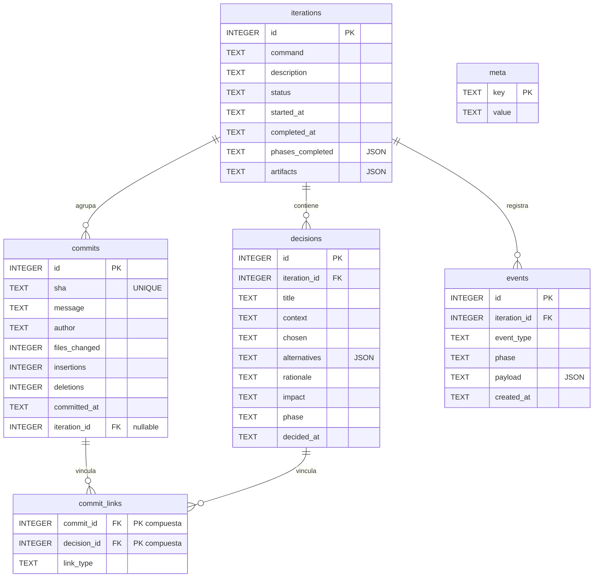
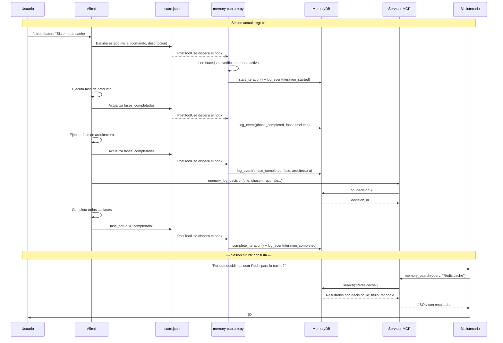

# Memoria persistente

Las conversaciones de Claude Code son efimeras por naturaleza: cuando una sesion termina, todo el contexto acumulado --decisiones de diseno, razones para descartar alternativas, compromisos entre rendimiento y mantenibilidad, el hilo de razonamiento que llevo a elegir una arquitectura concreta-- desaparece sin dejar rastro. Esto significa que cada vez que el desarrollador abre una sesion nueva, Alfred parte de cero. Si hace tres semanas se decidio usar SQLite en lugar de PostgreSQL tras un analisis detallado de las restricciones del proyecto, Alfred no lo sabe; si se descarto una aproximacion con Redis porque el despliegue no podia depender de servicios externos, Alfred tampoco lo recuerda.

La memoria persistente resuelve este problema almacenando decisiones, iteraciones, commits y eventos del flujo de trabajo en una base de datos SQLite local. Cada proyecto tiene su propia base de datos en `.claude/alfred-memory.db`, aislada del resto. Gracias a esta capa, Alfred puede responder preguntas como "por que decidimos no usar un ORM" o "que se implemento en la iteracion 3" con evidencia verificable, no con inferencias. La trazabilidad que proporciona es completa: desde el problema que se resolvia hasta el commit que lo implemento, pasando por las alternativas que se descartaron y la justificacion de cada eleccion.

La memoria es una **capa lateral opcional**. Si no se activa, el flujo del plugin sigue funcionando exactamente igual que siempre. No hay penalizacion por no usarla; simplemente, las sesiones futuras no tendran acceso al historico.


## Esquema de la base de datos

El esquema esta disenado para capturar cuatro tipos de informacion que se complementan entre si. Las **iteraciones** representan ciclos completos de trabajo (un feature, un fix, un spike); las **decisiones** capturan el razonamiento formal detras de cada eleccion; los **commits** vinculan las decisiones con el codigo real; y los **eventos** registran la cronologia mecanica del flujo (fases completadas, gates superadas).

La relacion entre estas tablas permite reconstruir la historia completa de un cambio: desde la iteracion que lo inicio, pasando por las decisiones que lo fundamentaron, hasta los commits que lo materializaron. La tabla intermedia `commit_links` establece la trazabilidad muchos-a-muchos entre commits y decisiones, porque un commit puede implementar varias decisiones y una decision puede requerir varios commits.



### Detalle de cada tabla

**iterations** almacena los ciclos de trabajo. El campo `command` indica el tipo de flujo (`feature`, `fix`, `spike`, `ship`, `audit`). El campo `status` evoluciona de `active` a `completed` o `abandoned`. Los campos `phases_completed` y `artifacts` son JSON opcionales que enriquecen el registro.

**decisions** captura el razonamiento formal. Cada decision tiene un `title` corto, el `context` del problema, la opcion `chosen`, las `alternatives` descartadas (almacenadas como array JSON), la `rationale` que justifica la eleccion, el `impact` (low, medium, high, critical) y la `phase` del flujo en la que se tomo. Si no se proporciona `iteration_id`, se vincula automaticamente a la iteracion activa.

**commits** registra metadatos de los commits de Git. El campo `sha` es unico para garantizar idempotencia: si se intenta registrar un commit que ya existe, la operacion se ignora silenciosamente. Esto permite que la captura automatica invoque `log_commit()` sin preocuparse de duplicados.

**commit_links** establece vinculos entre commits y decisiones. El campo `link_type` indica el tipo de relacion: `implements` (el commit implementa la decision), `reverts` (lo deshace) o `relates` (relacion generica). La clave primaria compuesta `(commit_id, decision_id)` impide duplicados.

**events** captura hechos mecanicos del flujo: fases completadas, gates superadas, aprobaciones. El campo `payload` es un JSON libre que almacena datos adicionales. Los eventos proporcionan la cronologia detallada que las decisiones no cubren.

**meta** almacena pares clave-valor de metadatos internos: version del esquema (`schema_version`), fecha de creacion (`created_at`), estado de FTS5 (`fts_enabled`).

### Indices

El esquema incluye cinco indices para acelerar las consultas mas frecuentes:

| Indice | Tabla | Columna | Proposito |
|--------|-------|---------|-----------|
| `idx_iterations_status` | iterations | status | Filtrar iteraciones activas rapidamente |
| `idx_decisions_iteration` | decisions | iteration_id | Obtener decisiones de una iteracion |
| `idx_commits_iteration` | commits | iteration_id | Obtener commits de una iteracion |
| `idx_events_iteration` | events | iteration_id | Obtener eventos de una iteracion |
| `idx_events_type` | events | event_type | Filtrar eventos por tipo |


## FTS5 (busqueda de texto completo)

FTS5 es una extension de SQLite que proporciona busqueda de texto completo de alto rendimiento. En el contexto de la memoria de Alfred Dev, permite buscar por terminos en el contenido de decisiones y commits sin necesidad de operadores `LIKE %termino%`, que son lentos porque requieren un recorrido completo de la tabla.

La razon de usar FTS5 en lugar de depender exclusivamente de `LIKE` es el rendimiento a escala. Un proyecto con cientos de decisiones y miles de commits necesita busquedas rapidas para que el agente Bibliotecario pueda responder consultas historicas sin latencia perceptible. FTS5 crea un indice invertido que permite busquedas en tiempo constante independientemente del tamano de la tabla.

### Tabla virtual `memory_fts`

Cuando FTS5 esta disponible, `MemoryDB` crea la tabla virtual `memory_fts` con tres columnas:

| Columna | Tipo | Contenido |
|---------|------|-----------|
| `source_type` | TEXT | Tipo de registro: `decision` o `commit` |
| `source_id` | TEXT | ID del registro original (cast a texto) |
| `content` | TEXT | Texto indexado (concatenacion de campos relevantes) |

Para las decisiones, el campo `content` concatena `title`, `context`, `chosen` y `rationale`. Para los commits, contiene unicamente el `message`.

### Triggers de sincronizacion

El indice FTS5 se mantiene sincronizado con las tablas origen mediante dos triggers `AFTER INSERT`:

- **`fts_insert_decision`**: se dispara al insertar una nueva decision. Concatena los campos de texto con `COALESCE` para manejar valores nulos y los inserta en `memory_fts`.
- **`fts_insert_commit`**: se dispara al insertar un nuevo commit. Inserta el mensaje del commit en `memory_fts`.

Los triggers garantizan que el indice FTS5 refleja siempre el estado actual de las tablas sin que el codigo de aplicacion tenga que preocuparse de mantener la coherencia.

### Deteccion en runtime y fallback a LIKE

No todos los entornos SQLite incluyen la extension FTS5. La deteccion se realiza en el metodo `_detect_fts5()` de `MemoryDB`, que intenta crear una tabla FTS5 temporal (`_fts5_test`). Si la operacion tiene exito, FTS5 esta disponible y se crea la tabla real con sus triggers. Si lanza un `OperationalError`, se marca `_fts_enabled = False` y todas las busquedas utilizan `LIKE %termino%` como fallback.

El resultado de la deteccion se persiste en la tabla `meta` con la clave `fts_enabled` (`"1"` o `"0"`) para que otros componentes --como el servidor MCP-- puedan consultarlo sin repetir la prueba.

El metodo `search()` de `MemoryDB` comprueba el flag `_fts_enabled` y delega automaticamente en `_search_fts()` o `_search_like()`. Desde el punto de vista del consumidor, la interfaz es identica en ambos casos; solo cambia la velocidad.


## Sanitizacion de secretos

La base de datos de memoria podria acabar almacenando secretos si un agente menciona una clave API en una decision o si un mensaje de commit contiene credenciales por error. Para evitar esta fuga, todo texto que entra en la base de datos pasa por `sanitize_content()`, que aplica 13 patrones regex y reemplaza cada coincidencia por un marcador `[REDACTED:<tipo>]`.

La razon de sanitizar en la capa de persistencia (no en la de presentacion) es que el dano de un secreto almacenado es permanente: una vez que la clave esta en la DB, cualquier consulta futura la expondria. Sanitizar antes de escribir garantiza que la informacion sensible nunca llega al disco.

Los patrones son los mismos que utiliza el hook `secret-guard.sh` para mantener coherencia en toda la cadena de seguridad del plugin. El orden importa: los patrones mas especificos van primero para evitar que uno generico consuma un match que deberia ser mas preciso.

### Patrones detectados

| # | Etiqueta | Que detecta | Patron resumido |
|---|----------|-------------|-----------------|
| 1 | `AWS_KEY` | Claves de acceso de AWS | `AKIA` seguido de 16 caracteres alfanumericos |
| 2 | `ANTHROPIC_KEY` | Claves API de Anthropic | Prefijo `sk-ant-` seguido de 20+ caracteres |
| 3 | `SK_KEY` | Claves con prefijo sk- generico (OpenAI, etc.) | Prefijo `sk-` seguido de 20+ caracteres alfanumericos |
| 4 | `GITHUB_TOKEN` | Tokens personales y PAT de GitHub | Prefijos `ghp_` (36 chars) o `github_pat_` (20+ chars) |
| 5 | `SLACK_TOKEN` | Tokens de Slack (bot, app, user) | Prefijo `xox[bpsa]-` seguido de 10+ caracteres |
| 6 | `GOOGLE_KEY` | Claves API de Google | Prefijo `AIza` seguido de 35 caracteres |
| 7 | `SENDGRID_KEY` | Claves API de SendGrid | Prefijo `SG.` con dos segmentos de 22+ caracteres |
| 8 | `PRIVATE_KEY` | Claves privadas (RSA, EC, DSA, OPENSSH) | Cabecera `-----BEGIN [...] PRIVATE KEY-----` |
| 9 | `JWT` | Tokens JWT codificados en Base64 | Tres segmentos Base64URL separados por puntos |
| 10 | `CONNECTION_STRING` | Cadenas de conexion a base de datos | Protocolo (mysql, postgresql, mongodb, redis, amqp) seguido de credenciales |
| 11 | `SLACK_WEBHOOK` | Webhooks de Slack | URL `hooks.slack.com/services/...` |
| 12 | `DISCORD_WEBHOOK` | Webhooks de Discord | URL `discord.com/api/webhooks/...` |
| 13 | `HARDCODED_CREDENTIAL` | Credenciales hardcodeadas en codigo | Asignaciones directas como `api_key = "valor"` |

### Campos sanitizados

Los siguientes campos de la base de datos pasan por `sanitize_content()` antes de cada escritura:

| Tabla | Campos sanitizados |
|-------|--------------------|
| decisions | `context`, `chosen`, `rationale`, `alternatives` (cada elemento del array) |
| commits | `message` |
| events | `payload` (cada valor de tipo string dentro del diccionario) |
| iterations | `description` |


## Servidor MCP

El servidor MCP (Model Context Protocol) es el proceso que expone la memoria persistente como herramientas invocables por los agentes de Claude Code. Se comunica mediante JSON-RPC 2.0 sobre stdin/stdout con encabezados `Content-Length`, un formato identico al de LSP (Language Server Protocol).

La razon de implementar un servidor MCP en lugar de acceder a la DB directamente desde los agentes es el modelo de ejecucion de Claude Code: los agentes no ejecutan Python arbitrario, sino que invocan herramientas definidas en un protocolo estandarizado. El servidor traduce las invocaciones MCP en llamadas a la API de `MemoryDB`.

### Ciclo de vida

Claude Code lanza el servidor al inicio de sesion y lo mantiene vivo como proceso persistente. La secuencia de arranque es:

1. **Resolucion de ruta**: la DB se ubica en `$PWD/.claude/alfred-memory.db`, relativa al directorio de trabajo del proyecto.
2. **Apertura de conexion**: se crea una instancia de `MemoryDB` con WAL activado y foreign keys habilitadas. La apertura es perezosa (se difiere hasta la primera invocacion de herramienta).
3. **Esquema**: `ensure_schema()` crea las tablas e indices si no existen. Si la DB es nueva, registra la version del esquema y la fecha de creacion en `meta`.
4. **Deteccion de FTS5**: `_detect_fts5()` comprueba el soporte de FTS5 y crea la tabla virtual con triggers si esta disponible.
5. **Purga de eventos**: si `retention_days > 0`, se eliminan los eventos anteriores a la ventana de retencion.
6. **Escucha**: el servidor queda a la espera de mensajes JSON-RPC por stdin.

### Herramientas expuestas

El servidor expone seis herramientas. Cada una se describe con un JSON Schema de entrada y se despacha internamente al metodo correspondiente de `MemoryDB`.

#### `memory_search(query, limit?, iteration_id?)`

Busca en la memoria del proyecto (decisiones y commits) por texto. Usa FTS5 si esta disponible, o `LIKE` como fallback. Devuelve una lista de resultados con el tipo de fuente (`decision` o `commit`), los datos completos del registro y metadatos de la busqueda (total de resultados, modo FTS activo o no).

| Parametro | Tipo | Obligatorio | Descripcion |
|-----------|------|-------------|-------------|
| `query` | string | si | Termino de busqueda textual |
| `limit` | integer | no | Maximo de resultados (por defecto 20) |
| `iteration_id` | integer | no | Filtrar por iteracion concreta |

#### `memory_log_decision(title, chosen, context?, alternatives?, rationale?, impact?, phase?)`

Registra una decision de diseno formal. Se vincula automaticamente a la iteracion activa si no se indica otra. Todos los campos de texto se sanitizan antes de persistir.

| Parametro | Tipo | Obligatorio | Descripcion |
|-----------|------|-------------|-------------|
| `title` | string | si | Titulo corto de la decision |
| `chosen` | string | si | Opcion elegida |
| `context` | string | no | Problema que se resolvia |
| `alternatives` | string[] | no | Opciones descartadas |
| `rationale` | string | no | Justificacion de la eleccion |
| `impact` | enum | no | Nivel: `low`, `medium`, `high`, `critical` |
| `phase` | string | no | Fase del flujo en la que se tomo |

#### `memory_log_commit(sha, message?, decision_ids?, iteration_id?)`

Registra un commit y opcionalmente lo vincula a decisiones previas. Si el SHA ya existe, la operacion se ignora (idempotente). Las vinculaciones se crean como enlaces de tipo `implements`.

| Parametro | Tipo | Obligatorio | Descripcion |
|-----------|------|-------------|-------------|
| `sha` | string | si | Hash SHA del commit |
| `message` | string | no | Mensaje del commit |
| `decision_ids` | integer[] | no | IDs de decisiones a vincular |
| `iteration_id` | integer | no | ID de iteracion (auto-detectado si se omite) |

#### `memory_get_iteration(id?)`

Obtiene los datos completos de una iteracion, enriquecidos con las decisiones asociadas. Si no se indica ID, devuelve la iteracion activa; si no hay activa, devuelve la mas reciente.

| Parametro | Tipo | Obligatorio | Descripcion |
|-----------|------|-------------|-------------|
| `id` | integer | no | ID de la iteracion |

#### `memory_get_timeline(iteration_id)`

Obtiene la cronologia completa de eventos de una iteracion, ordenados del mas antiguo al mas reciente. Permite reconstruir la secuencia exacta de fases, gates y aprobaciones.

| Parametro | Tipo | Obligatorio | Descripcion |
|-----------|------|-------------|-------------|
| `iteration_id` | integer | si | ID de la iteracion |

#### `memory_stats()`

Devuelve estadisticas generales de la memoria: contadores de iteraciones, decisiones, commits y eventos; estado de FTS5; version del esquema; fecha de creacion; ruta de la DB.

No requiere parametros.


## El Bibliotecario

El Bibliotecario es un agente opcional que actua como interfaz de consulta sobre la memoria persistente. Su nombre interno es `librarian` y se activa en la configuracion del proyecto (`agentes_opcionales.librarian: true`). A diferencia de los agentes de nucleo, que participan en todas las sesiones, el Bibliotecario solo interviene cuando hay memoria activa y el usuario o Alfred necesitan consultar el historico.

La filosofia del Bibliotecario es la de un archivero de tribunal: cada dato que proporciona debe poder rastrearse hasta su origen. No inventa, no supone, no extrapola. Si la memoria no tiene registros sobre algo, lo dice sin rodeos. Esta restriccion deliberada es lo que hace que sus respuestas tengan valor: si el Bibliotecario dice que una decision existe, existe; si dice que no hay registros, no los hay.

### Clasificacion de preguntas

Antes de consultar la memoria, el Bibliotecario clasifica cada pregunta en una de cuatro categorias para elegir la herramienta MCP mas adecuada:

| Categoria | Tipo de pregunta | Herramienta principal | Ejemplo |
|-----------|------------------|-----------------------|---------|
| Decision | que / por que | `memory_search` | "Por que usamos SQLite en vez de PostgreSQL" |
| Implementacion | que commit | `memory_search` (commits) | "En que commit se anadio el hook de seguridad" |
| Cronologia | cuando | `memory_get_timeline` | "Que paso en la iteracion 3" |
| Estadistica | cuantas / cuanto | `memory_stats` | "Cuantas decisiones hay registradas" |

### Formato de citas

Toda respuesta que incluya datos de la memoria debe citar su fuente. Los formatos validos son:

| Tipo | Formato | Ejemplo |
|------|---------|---------|
| Decision | `[D#<id>]` | `[D#12] 2026-02-15 -- Usar SQLite` |
| Commit | `[C#<sha_corto>]` | `[C#a1b2c3d] 2026-02-16 -- feat: memoria persistente` |
| Iteracion | `[I#<id>]` | `[I#5] feature -- Sistema de memoria` |
| Evento | `[E#<id>]` | `[E#42] phase_completed 2026-02-15` |

Si no puede citar una fuente concreta, el Bibliotecario no incluye el dato en la respuesta. Esta regla esta marcada como `HARD-GATE` en su definicion de agente: no admite excepciones.


## Captura automatica

La captura automatica funciona mediante el hook `memory-capture.py`, un script Python que se ejecuta como hook `PostToolUse` cada vez que Claude Code escribe o edita un fichero. El hook actua como un observador pasivo: nunca bloquea la operacion ni interfiere con el flujo de trabajo. Si algo falla --DB inexistente, JSON corrupto, configuracion ausente--, sale silenciosamente con `exit 0`.

La razon de automatizar la captura en lugar de depender de que los agentes registren eventos manualmente es la fiabilidad: un agente puede olvidarse de llamar a `memory_log_event()`, pero el hook siempre se ejecuta porque esta conectado al ciclo de vida de las herramientas de escritura.

### Que vigila

El hook solo actua cuando detecta una escritura sobre el fichero `alfred-dev-state.json`, que es el fichero de estado de sesion de Alfred Dev. Cualquier otra escritura se ignora inmediatamente.

### Logica de captura

Cuando detecta una escritura en el fichero de estado, el hook ejecuta tres comprobaciones en secuencia:

1. **Iteracion nueva**: si no hay iteracion activa en la DB, se inicia una nueva con los datos del estado (`comando`, `descripcion`) y se registra un evento `iteration_started`.

2. **Fases completadas**: compara las fases completadas del estado nuevo con los eventos `phase_completed` ya registrados en la DB. Por cada fase nueva que no tenga evento, registra un `phase_completed` con el nombre de la fase, su resultado, la fecha de completado y los artefactos generados.

3. **Iteracion completada**: si la `fase_actual` del estado es `"completado"`, cierra la iteracion activa y registra un evento `iteration_completed`.

### Verificacion previa

Antes de procesar el estado, el hook comprueba que la memoria esta habilitada leyendo el fichero `.claude/alfred-dev.local.md` del proyecto. Busca el patron `memoria:` seguido de `enabled: true` usando una expresion regular que tolera comentarios y otras claves intermedias.


## Flujo completo de captura y consulta

El siguiente diagrama muestra como se conectan todos los componentes, desde la accion del usuario hasta la consulta historica en una sesion futura.




## Ciclo de vida de la base de datos

La base de datos se crea automaticamente la primera vez que se activa la memoria en un proyecto. El proceso de creacion sigue una secuencia deliberada para garantizar seguridad e integridad desde el primer momento.

### Creacion

El constructor de `MemoryDB` crea el directorio padre (`.claude/`) si no existe, abre la conexion SQLite y ejecuta la siguiente secuencia:

1. **PRAGMA journal_mode=WAL**: activa el modo Write-Ahead Logging, que permite lecturas concurrentes mientras se realizan escrituras. Esto es importante porque el servidor MCP y el hook de captura pueden acceder a la DB simultaneamente.

2. **PRAGMA foreign_keys=ON**: activa las restricciones de clave foranea. Sin este pragma, SQLite ignora las declaraciones `REFERENCES` y permite inconsistencias (por ejemplo, una decision que referencia una iteracion inexistente).

3. **ensure_schema()**: crea las tablas e indices si no existen. Si la DB es nueva, registra `schema_version` y `created_at` en la tabla `meta`.

4. **_detect_fts5()**: comprueba el soporte de FTS5 y crea la tabla virtual con triggers si esta disponible.

5. **chmod 0600**: establece permisos restrictivos (solo el propietario puede leer y escribir). Si el sistema de ficheros no soporta `chmod` (por ejemplo, FAT32), se continua sin permisos restrictivos.

### Retencion

La politica de retencion diferencia entre tipos de datos segun su valor a largo plazo:

| Tipo de dato | Politica de retencion | Razon |
|--------------|----------------------|-------|
| Decisiones | No se purgan nunca | El razonamiento detras de una decision es valioso indefinidamente |
| Iteraciones | No se purgan nunca | Son el contexto de las decisiones y commits |
| Commits | No se purgan nunca | Son el vinculo con el codigo real |
| Eventos | Se purgan tras `retention_days` | Son datos mecanicos cuyo valor decrece con el tiempo |

La purga de eventos se ejecuta automaticamente al arrancar el servidor MCP. El metodo `purge_old_events()` elimina los eventos cuyo `created_at` sea anterior a la fecha actual menos `retention_days`. El valor por defecto es 365 dias, configurable via la variable de entorno `ALFRED_MEMORY_RETENTION_DAYS` o la clave `memoria.retention_days` en la configuracion del proyecto.

### Versionado del esquema

La tabla `meta` almacena la version del esquema con la clave `schema_version`. La version actual es `1`. Este valor se usara en el futuro para detectar si es necesario aplicar migraciones al abrir una DB creada con una version anterior del plugin.


## Configuracion

La memoria persistente se configura en la seccion `memoria` del fichero `.claude/alfred-dev.local.md` del proyecto. Tambien se puede gestionar de forma interactiva con `/alfred config`.

### Claves de configuracion

| Clave | Tipo | Defecto | Descripcion |
|-------|------|---------|-------------|
| `enabled` | boolean | `false` | Activa o desactiva la memoria persistente |
| `capture_decisions` | boolean | `true` | Registrar decisiones de diseno automaticamente |
| `capture_commits` | boolean | `true` | Registrar commits automaticamente |
| `retention_days` | integer | `365` | Dias de retencion de eventos (decisiones e iteraciones no se purgan) |

### Ejemplo minimo de activacion

Para activar la memoria con los valores por defecto, basta con anadir lo siguiente al frontmatter del fichero de configuracion:

```yaml
---
memoria:
  enabled: true
---
```

### Ejemplo completo

```yaml
---
memoria:
  enabled: true
  capture_decisions: true
  capture_commits: true
  retention_days: 365

agentes_opcionales:
  librarian: true
---
```

Activar el agente `librarian` junto con la memoria es la combinacion recomendada: la memoria almacena los datos y el Bibliotecario proporciona la interfaz de consulta. Sin el Bibliotecario, la memoria sigue funcionando (los datos se registran), pero las consultas historicas requieren invocaciones MCP directas en lugar de un agente especializado que interprete y cite los resultados.


## Ficheros fuente de referencia

| Fichero | Contenido |
|---------|-----------|
| `core/memory.py` | Clase `MemoryDB`, funcion `sanitize_content()`, esquema SQL, patrones de secretos, logica de FTS5 |
| `mcp/memory_server.py` | Clase `MemoryMCPServer`, definicion de herramientas MCP, transporte JSON-RPC stdio |
| `hooks/memory-capture.py` | Hook PostToolUse, deteccion de escrituras en state.json, captura automatica de eventos |
| `agents/optional/librarian.md` | Definicion del agente Bibliotecario, reglas de cita, clasificacion de preguntas |
