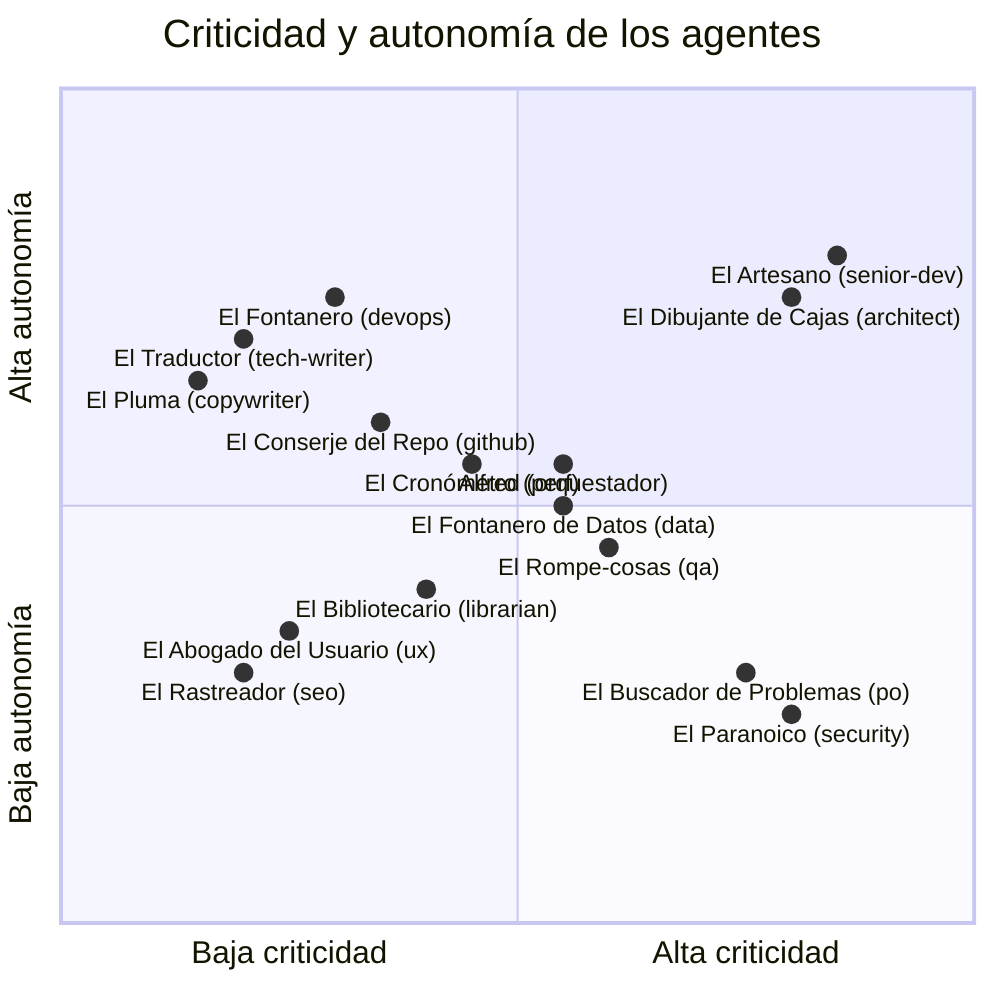

# Motor de personalidad

Cuando un equipo virtual tiene quince agentes trabajando en paralelo, los system prompts genéricos se convierten en un problema real: todas las respuestas suenan igual, el desarrollador no sabe quién le está hablando y la información se diluye en una masa de texto uniforme. La decisión de diseño de asignar nombre, frases propias y tono a cada agente no es un capricho estético; responde a tres necesidades concretas de ingeniería:

1. **Distinguibilidad inmediata.** En un flujo donde intervienen varios agentes, cada uno debe ser reconocible al instante. Si El Rompe-cosas (QA) dice "esto no pasa mis pruebas", el desarrollador sabe de inmediato quién habla, qué autoridad tiene y qué acción espera. No necesita leer una cabecera de metadatos para orientarse.

2. **Coherencia de voz.** Un agente con personalidad definida genera respuestas más consistentes a lo largo de una sesión. El modelo de lenguaje tiende a mantener el registro cuando el prompt de sistema incluye rasgos de carácter concretos, en lugar de instrucciones abstractas del tipo "sé útil y conciso".

3. **Memoria asociativa del usuario.** Las frases características actúan como anclas cognitivas. Después de unas pocas interacciones, el usuario asocia un tono a una función: el sarcasmo contenido de El Paranoico (seguridad) con alertas de seguridad, la meticulosidad de El Artesano (senior dev) con calidad de código. Esto reduce la carga cognitiva en sesiones largas.

Todo el sistema de personalidad reside en un único fichero fuente (`core/personality.py`) que actúa como fuente de verdad. No hay configuración dispersa: si necesitas cambiar el tono de un agente, la referencia es un solo diccionario.

---

## Estructura de datos

El núcleo del motor es el diccionario `AGENTS`, definido en `core/personality.py`. Cada clave es el identificador interno del agente (en kebab-case, como `senior-dev` o `qa-engineer`) y su valor es un diccionario con los campos que describen su identidad completa.

La razón de usar un diccionario plano en lugar de clases u objetos más elaborados es la simplicidad: los consumidores (commands, hooks, el orquestador) solo necesitan acceder a campos por clave, nunca invocar métodos del agente. Un diccionario es más fácil de serializar, de inspeccionar en depuración y de extender sin romper contratos.

| Campo | Tipo | Descripción | Ejemplo |
|---|---|---|---|
| `nombre_display` | `str` | Nombre visible del agente, el que aparece en la terminal y en los mensajes. | `"Alfred"`, `"El Rompe-cosas"` |
| `rol` | `str` | Descripción de una frase que resume la función del agente en el equipo. | `"Jefe de operaciones / Orquestador"` |
| `color` | `str` | Color de terminal para identificación visual. Permite distinguir agentes en logs y salida formateada sin leer el nombre. | `"blue"`, `"red"`, `"orange"` |
| `modelo` | `str` | Modelo de IA asignado: `"opus"` para agentes críticos, `"sonnet"` para el resto. La sección [Distribución de modelos](#distribución-de-modelos) explica el criterio. | `"opus"`, `"sonnet"` |
| `personalidad` | `str` | Párrafo que define el tono, la actitud y los rasgos de carácter del agente. Se inyecta en el system prompt para que el modelo de lenguaje mantenga la voz a lo largo de la sesión. | *(ver fichero fuente)* |
| `frases` | `List[str]` | Lista de frases base que representan la voz del agente en niveles de sarcasmo normales (<= 3). Son frases con personalidad pero dentro de un registro profesional. | `["Venga, vamos a ello. Ya tengo un plan."]` |
| `frases_sarcasmo_alto` | `List[str]` | Frases adicionales que se incorporan al pool cuando el nivel de sarcasmo es >= 4. El tono sube, pero sin cruzar la línea del insulto. | `["A ver, esa idea... cómo te lo digo suave... es terrible."]` |
| `opcional` | `bool` | Solo presente (y con valor `True`) en los 7 agentes opcionales. Los agentes opcionales están predefinidos en el diccionario pero no participan en los flujos a menos que el usuario los active explícitamente en su configuración local (`alfred-dev.local.md`). Si el campo no existe, el agente es obligatorio. | `True` |

Los 8 agentes obligatorios (los que no llevan `opcional: True`) participan siempre en los flujos del plugin. Los 7 opcionales son especialistas de dominio que el usuario activa según las necesidades de su proyecto: un proyecto sin base de datos no necesita a `data-engineer`, una CLI sin interfaz web no necesita a `seo-specialist`.

---

## Niveles de sarcasmo

El sarcasmo es un entero de 1 a 5 que controla el tono de las respuestas de todos los agentes. La idea es dar al usuario el control sobre el registro comunicativo sin necesidad de editar prompts: un mismo equipo puede funcionar en modo corporativo (nivel 1) o en modo "viernes por la tarde" (nivel 5).

### Qué cambia en cada nivel

| Nivel | Registro | Pool de frases | Efecto práctico |
|:---:|---|---|---|
| 1 | Profesional, neutro. | Solo `frases`. | Las respuestas son directas y formales. Adecuado para demos, entornos compartidos o cuando el código lo lee un cliente. |
| 2 | Profesional con matiz. | Solo `frases`. | Ligero toque de personalidad. El agente se permite alguna observación con gracia, pero sin salirse del guion. |
| 3 | Equilibrado (por defecto). | Solo `frases`. | El punto medio: las frases base ya tienen personalidad suficiente para que cada agente suene distinto sin resultar agresivo. Es el valor por defecto porque funciona bien en la mayoría de contextos. |
| 4 | Mordaz. | `frases` + `frases_sarcasmo_alto`. | Se cruza el umbral: las frases ácidas entran en el pool. Los agentes se vuelven más directos y punzantes en sus comentarios. |
| 5 | Ácido. | `frases` + `frases_sarcasmo_alto`. | Máximo nivel de descaro. Las frases más afiladas tienen la misma probabilidad de aparecer que las base. |

El umbral está en el nivel 4 y la razón es deliberada: los tres primeros niveles comparten exactamente el mismo pool de frases base, de modo que la diferencia entre ellos es sutil y se manifiesta más en el párrafo de personalidad que en las frases sueltas. Al cruzar al 4, el cambio es perceptible porque se incorporan frases nuevas con un tono claramente distinto. Esto evita la zona gris donde el usuario no sabe si ha cambiado algo o no.

### Selección de frases

La selección de frases dentro de `get_agent_intro` es determinista: se usa el nivel de sarcasmo como semilla para calcular un índice sobre la lista de frases disponibles, mediante la operación `(nivel_sarcasmo - 4) % len(frases_acidas)`. Esto garantiza que, para un mismo agente y un mismo nivel, la frase elegida sea siempre la misma, lo que facilita los tests y hace predecible el comportamiento del sistema.

En `get_agent_voice`, en cambio, no se selecciona una frase concreta: se devuelve la lista completa para que el consumidor (normalmente un command o un hook) elija la que mejor encaje en su contexto.

---

## Funciones públicas

El módulo expone dos funciones públicas y una función auxiliar interna. Las funciones públicas son el contrato con el resto del sistema; la función interna centraliza la validación para evitar duplicación.

### `get_agent_intro(agent_name, nivel_sarcasmo=3)`

Genera la presentación completa de un agente. La presentación incluye el nombre visible, el rol y el párrafo de personalidad. Cuando el nivel de sarcasmo es >= 4, se añade una coletilla extraída de `frases_sarcasmo_alto` al final de la introducción.

**Parámetros:**

| Parámetro | Tipo | Valor por defecto | Descripción |
|---|---|---|---|
| `agent_name` | `str` | *(obligatorio)* | Identificador del agente (clave en `AGENTS`). |
| `nivel_sarcasmo` | `int` | `3` | Entero de 1 a 5 que controla el tono. |

**Retorno:** `str` con la presentación formateada.

**Excepciones:** `ValueError` si el agente no existe en `AGENTS`. El mensaje de error incluye la lista completa de agentes disponibles para facilitar la depuración.

**Ejemplo de uso:**

```python
# Presentación estándar (nivel 3)
intro = get_agent_intro("alfred")
# -> "Soy Alfred, tu Jefe de operaciones / Orquestador. El colega que..."

# Presentación ácida (nivel 5)
intro = get_agent_intro("alfred", nivel_sarcasmo=5)
# -> "Soy Alfred, tu Jefe de operaciones / Orquestador. El colega que...
#     Me encantaría emocionarme con esa propuesta, pero no me sale."
```

La razón de que el nivel por defecto sea 3 y no 1 es que el sistema está diseñado para que la personalidad sea perceptible desde el primer momento. Un nivel 1 no añade frases ácidas, pero el párrafo de personalidad ya tiene tono propio; el nivel 3 es el punto en el que el sistema "suena como se espera" sin que el usuario tenga que configurar nada.

### `get_agent_voice(agent_name, nivel_sarcasmo=3)`

Devuelve la lista completa de frases disponibles para un agente, filtrada según el nivel de sarcasmo. Esta función es útil para commands que necesitan seleccionar frases de forma programática (por ejemplo, para insertar una frase aleatoria en la salida de un veredicto o para decorar un mensaje de progreso).

**Parámetros:**

| Parámetro | Tipo | Valor por defecto | Descripción |
|---|---|---|---|
| `agent_name` | `str` | *(obligatorio)* | Identificador del agente (clave en `AGENTS`). |
| `nivel_sarcasmo` | `int` | `3` | Entero de 1 a 5 que controla el tono. |

**Retorno:** `List[str]` con las frases del agente. Con sarcasmo < 4, solo las frases base; con sarcasmo >= 4, base + frases ácidas.

**Excepciones:** `ValueError` si el agente no existe en `AGENTS`.

**Ejemplo de uso:**

```python
# Solo frases base
frases = get_agent_voice("qa-engineer", nivel_sarcasmo=2)
# -> ["He encontrado un bug. Sorpresa: ninguna.", ...]  (4 frases)

# Base + sarcasmo alto
frases = get_agent_voice("qa-engineer", nivel_sarcasmo=5)
# -> ["He encontrado un bug...", ..., "He roto tu código en 3 segundos..."]  (6 frases)
```

### `_validate_agent(agent_name)` *(interna)*

Función auxiliar que comprueba si el nombre del agente existe en `AGENTS` y devuelve su diccionario de configuración. Si no existe, lanza `ValueError` con un mensaje que lista todos los agentes disponibles ordenados alfabéticamente. Ambas funciones públicas la invocan como primer paso, lo que centraliza la validación y garantiza mensajes de error consistentes.

---

## Distribución de criticidad y autonomía de los agentes

El siguiente diagrama posiciona a los 15 agentes en un espacio de dos dimensiones: la criticidad de las tareas que manejan (eje horizontal) y el grado de autonomía con el que operan (eje vertical). La posición de cada agente no es arbitraria; refleja cómo encaja su función en el flujo de trabajo del plugin.

Los agentes con alta criticidad y baja autonomía (esquina inferior derecha) son los que trabajan con restricciones estrictas: El Paranoico (seguridad) no puede aprobar por su cuenta, necesita que el orquestador confirme. Los de alta criticidad y alta autonomía (esquina superior derecha) son los que toman decisiones de diseño y escriben código sin pedir permiso en cada línea. Los de baja criticidad y alta autonomía (esquina superior izquierda) son agentes de soporte que pueden operar de forma independiente sin riesgo para el sistema.



Algunas observaciones sobre la distribución:

- **Alfred** ocupa una posición central-alta porque su función es coordinar, no ejecutar. Su criticidad es moderada (no escribe código de producción) pero su autonomía es significativa (decide qué agentes intervienen y en qué orden).
- **El Artesano y El Dibujante de Cajas** están en la esquina de máxima criticidad y autonomía: son los que toman decisiones técnicas irreversibles (arquitectura, código de producción) y necesitan operar con libertad para ser eficaces.
- **El Buscador de Problemas y El Paranoico** tienen alta criticidad pero baja autonomía: sus decisiones (requisitos, seguridad) requieren validación explícita porque un error en esas áreas puede tener consecuencias graves y difíciles de revertir.
- **El Rompe-cosas (QA)** está en la zona media: su trabajo es crítico (detectar fallos) pero opera dentro de unos márgenes definidos (los tests que ejecuta, los criterios que aplica).

---

## Formato de veredicto estandarizado

Todos los agentes utilizan el mismo formato estructurado cuando emiten un veredicto en las quality gates del flujo de trabajo. La estandarización no es un capricho burocrático: Alfred (el orquestador) necesita parsear los veredictos de forma programática para decidir si el flujo avanza, se detiene o vuelve atrás. Si cada agente usara su propio formato, el orquestador necesitaría un parser distinto por agente, lo que multiplicaría la complejidad y los puntos de fallo.

### Estructura del veredicto

| Campo | Tipo | Valores posibles | Descripción |
|---|---|---|---|
| `tipo` | `str` | `APROBADO`, `APROBADO CON CONDICIONES`, `RECHAZADO` | Resultado del análisis del agente. |
| `observaciones` | `List[str]` | *(lista de cadenas)* | Hallazgos concretos, siempre presentes aunque sea una lista vacía. Cada observación describe un hecho, no una opinión. |
| `recomendaciones` | `List[str]` | *(lista de cadenas, opcional)* | Sugerencias de mejora que no bloquean el avance. Solo se incluyen cuando el agente tiene propuestas accionables. |

### Semántica de los tipos

- **APROBADO**: el agente no ha encontrado problemas que bloqueen el avance. Las observaciones pueden contener notas informativas, pero ninguna requiere acción inmediata.
- **APROBADO CON CONDICIONES**: el agente ha encontrado problemas que deben resolverse, pero considera que se pueden abordar en paralelo al siguiente paso del flujo. Las observaciones describen las condiciones que deben cumplirse.
- **RECHAZADO**: el agente ha encontrado problemas que bloquean el avance. El flujo no puede continuar hasta que se resuelvan las observaciones marcadas como bloqueantes.

La razón de tener tres niveles en lugar de un simple binario (aprobado/rechazado) es práctica: en un flujo real, muchas observaciones son mejorables pero no bloqueantes. El nivel intermedio permite que el flujo avance mientras se corrigen detalles, lo que evita cuellos de botella innecesarios sin sacrificar rigor.

---

## Distribución de modelos

De los 15 agentes, 5 usan el modelo `opus` y los 10 restantes usan `sonnet`. La distribución no es uniforme a propósito: cada modelo tiene un coste y un perfil de rendimiento distinto, y asignar opus a todos los agentes sería un desperdicio de recursos sin ganancia proporcional.

### Criterio de asignación

La regla es sencilla: **opus para agentes que toman decisiones de diseño irreversibles o escriben código de producción; sonnet para agentes de soporte, revisión y documentación donde la velocidad importa más que la profundidad de razonamiento.**

Una decisión de arquitectura mal tomada puede costar días de refactorización; un error en la documentación se corrige en minutos. El coste de usar opus donde sonnet basta es real (mayor latencia, mayor consumo de tokens), y el beneficio marginal es despreciable en tareas de formato, revisión estilística o etiquetado de issues.

### Agentes con opus (5)

| Agente | Identificador | Justificación |
|---|---|---|
| Alfred | `alfred` | Orquesta todo el flujo. Sus decisiones sobre qué agentes intervienen y en qué orden afectan al resultado final de forma directa. Un error de orquestación puede invalidar el trabajo de todos los demás. |
| El Buscador de Problemas | `product-owner` | Define requisitos y prioridades. Si los requisitos están mal planteados, todo el desarrollo parte de una base incorrecta. |
| El Dibujante de Cajas | `architect` | Diseña la estructura del sistema. Las decisiones de arquitectura son las más difíciles de revertir una vez implementadas. |
| El Artesano | `senior-dev` | Escribe código de producción. La calidad del código que genera determina directamente la calidad del entregable. |
| El Paranoico | `security-officer` | Evalúa la seguridad. Un falso negativo en seguridad (no detectar una vulnerabilidad) puede tener consecuencias graves. Opus ofrece mayor capacidad de razonamiento para detectar patrones sutiles. |

### Agentes con sonnet (10)

| Agente | Identificador | Justificación |
|---|---|---|
| El Rompe-cosas | `qa-engineer` | Ejecuta verificaciones sobre criterios definidos. La tarea es más mecánica que creativa. |
| El Fontanero | `devops-engineer` | Gestiona pipelines e infraestructura con patrones bien establecidos. |
| El Traductor | `tech-writer` | Genera documentación. La velocidad de generación es más valiosa que la profundidad. |
| El Fontanero de Datos | `data-engineer` | Trabaja con esquemas y queries siguiendo reglas conocidas. |
| El Abogado del Usuario | `ux-reviewer` | Revisa accesibilidad y flujos UX con listas de verificación estándar. |
| El Cronómetro | `performance-engineer` | Analiza métricas de rendimiento, tarea basada en umbrales objetivos. |
| El Conserje del Repo | `github-manager` | Gestiona issues, PRs y releases con operaciones predecibles. |
| El Rastreador | `seo-specialist` | Verifica meta tags y datos estructurados contra especificaciones conocidas. |
| El Pluma | `copywriter` | Genera y revisa textos. Sonnet es suficiente para mantener coherencia de tono. |
| El Bibliotecario | `librarian` | Consulta y mantiene la memoria del proyecto. Opera sobre datos existentes sin generar decisiones de diseño. |

---

## Muestras de frases por nivel de sarcasmo

Para visualizar cómo cambia el tono del sistema según el nivel de sarcasmo, a continuación se muestran frases reales de tres agentes representativos: Alfred (orquestador, opus), El Rompe-cosas (QA, sonnet) y El Paranoico (seguridad, opus). Las frases de nivel 1 y 3 provienen del pool base; las de nivel 5, del pool combinado (base + sarcasmo alto).

### Alfred (orquestador)

| Nivel | Frase |
|:---:|---|
| 1 | "Venga, vamos a ello. Ya tengo un plan." |
| 1 | "Todo listo. Cuando quieras, empezamos." |
| 1 | "Esto se puede simplificar, y lo sabes." |
| 3 | "Sobreingeniar es el camino al lado oscuro. No vayas por ahí." |
| 3 | "Ya he preparado los tests mientras decidías qué hacer." |
| 5 | "A ver, esa idea... cómo te lo digo suave... es terrible." |
| 5 | "Ah, otro framework nuevo. Coleccionar frameworks no es un hobby válido." |
| 5 | "Me encantaría emocionarme con esa propuesta, pero no me sale." |

### El Rompe-cosas (QA)

| Nivel | Frase |
|:---:|---|
| 1 | "Los tests unitarios no bastan. Necesitamos integración, e2e, carga..." |
| 1 | "Ese edge case que no contemplaste? Lo encontré." |
| 3 | "He encontrado un bug. Sorpresa: ninguna." |
| 3 | "Funciona en tu máquina? Pues en la mía no." |
| 5 | "Vaya, otro bug. Empiezo a pensar que es una feature." |
| 5 | "He roto tu código en 3 segundos. Récord personal." |

### El Paranoico (seguridad)

| Nivel | Frase |
|:---:|---|
| 1 | "Necesitamos cifrar esto. Y aquello. Y todo lo demás." |
| 1 | "Has pensado en los ataques de canal lateral?" |
| 3 | "Eso no está sanitizado. Nada está sanitizado." |
| 3 | "Confianza cero. Ni en ti, ni en mí, ni en nadie." |
| 5 | "Claro, dejemos el puerto abierto, que entre quien quiera." |
| 5 | "Seguro que los hackers se toman el fin de semana libre, no?" |
| 5 | "Ese token en el repo? Pura gestión de riesgos extremos." |

La diferencia clave está en la intención comunicativa: en niveles bajos, las frases informan y aconsejan; en el nivel 3, añaden personalidad sin perder el foco; en el nivel 5, el agente se permite ironía y sarcasmo abierto. En todos los casos, las frases transmiten información útil: incluso la más ácida señala un problema real. El sarcasmo no sustituye al contenido, lo acompaña.
