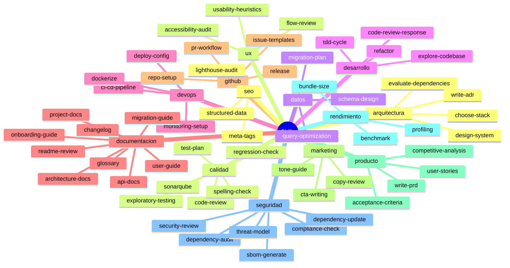

# Catalogo de skills

Los skills son las capacidades concretas que los agentes de Alfred pueden ejecutar. Cada skill es un fichero Markdown (`SKILL.md`) que contiene instrucciones paso a paso para una tarea especifica: desde disenar un esquema de base de datos hasta auditar la accesibilidad de una interfaz. Los agentes no improvisan; siguen las instrucciones del skill asignado para garantizar que el resultado sea consistente, reproducible y de calidad profesional.

La razon de separar los skills de los agentes es la misma por la que una empresa separa los procedimientos de los roles: un procedimiento (skill) puede ser ejecutado por diferentes personas (agentes) segun el contexto, y un mismo rol puede dominar multiples procedimientos. Esta separacion permite que el sistema crezca sin acoplar capacidades a identidades.

Los 55 skills se organizan en 13 dominios tematicos que cubren todo el ciclo de vida del software, desde la definicion de producto hasta la optimizacion SEO. Cada dominio agrupa skills que comparten un area de conocimiento comun, lo que facilita la navegacion y la asignacion a agentes especializados.

## Mapa de dominios y skills

El siguiente diagrama muestra la organizacion completa del catalogo. Cada rama principal es un dominio y las hojas son los skills individuales que contiene.



---

## Arquitectura

El dominio de arquitectura agrupa las capacidades relacionadas con el diseno estructural del software: desde la eleccion del stack tecnologico hasta la documentacion formal de las decisiones de diseno. Estos skills se ejecutan antes de escribir codigo, porque las decisiones arquitectonicas son las mas costosas de revertir y las que mas condicionan la evolucion futura del proyecto. El agente responsable es el **architect**, que aplica estos skills durante la fase 2 (arquitectura) del flujo feature o cuando se invoca directamente para consultas de diseno.

| Skill | Descripcion | Agente |
|-------|-------------|--------|
| `choose-stack` | Evalua alternativas tecnologicas con una matriz de decision ponderada para elegir el stack del proyecto | architect |
| `design-system` | Disena la arquitectura de un sistema con diagramas de componentes, contratos entre modulos y decisiones justificadas | architect |
| `evaluate-dependencies` | Analiza si una dependencia externa merece la pena antes de anadirla, evaluando tamano, mantenimiento, seguridad y alternativas | architect |
| `write-adr` | Genera un Architecture Decision Record (ADR) con contexto, alternativas evaluadas, decision y consecuencias | architect |

---

## Calidad

El dominio de calidad cubre todo lo relacionado con la verificacion del software: revisiones de codigo, planificacion de tests, deteccion de regresiones y analisis estatico. La premisa es que la calidad no se anade al final, sino que se construye en cada fase del desarrollo. El agente principal es el **qa-engineer**, que actua como guardian de calidad en la fase 4 del flujo feature, en la validacion de fixes y en las auditorias finales antes de un despliegue. El skill `spelling-check` puede ser ejecutado tambien por el **tech-writer** cuando se revisan documentos.

| Skill | Descripcion | Agente |
|-------|-------------|--------|
| `code-review` | Revisa codigo con foco en legibilidad, errores logicos, manejo de errores y complejidad | qa-engineer |
| `exploratory-testing` | Ejecuta sesiones de testing exploratorio estructurado con heuristicas, documentacion en tiempo real y clasificacion de hallazgos | qa-engineer |
| `regression-check` | Verifica que los cambios nuevos no rompen funcionalidad existente mediante analisis de impacto y ejecucion de tests | qa-engineer |
| `sonarqube` | Levanta SonarQube con Docker, ejecuta analisis estatico del codigo y traduce los resultados en mejoras accionables | qa-engineer |
| `spelling-check` | Verifica ortografia en castellano (tildes, concordancia, puntuacion) en codigo, documentacion e interfaz | qa-engineer |
| `test-plan` | Genera un plan de testing priorizado por riesgo que cubre unitarios, integracion, e2e, edge cases y escenarios negativos | qa-engineer |

---

## Datos

El dominio de datos aborda el modelado, la migracion y la optimizacion de bases de datos relacionales. Un esquema mal disenado o una migracion mal planificada pueden causar perdida de datos, downtime o degradacion de rendimiento que son extremadamente costosos de corregir una vez en produccion. El agente responsable es el **data-engineer**, un agente opcional que se activa cuando el proyecto trabaja con bases de datos, ORMs o pipelines de datos.

| Skill | Descripcion | Agente |
|-------|-------------|--------|
| `migration-plan` | Planifica migraciones de base de datos con script forward, script de rollback, estimacion de impacto y verificacion post-migracion | data-engineer |
| `query-optimization` | Optimiza queries lentas usando EXPLAIN, creacion de indices y reescritura, con benchmarks antes y despues | data-engineer |
| `schema-design` | Disena esquemas de base de datos normalizados (3NF) con indices justificados, constraints de integridad y documentacion | data-engineer |

---

## Desarrollo

El dominio de desarrollo contiene los skills de implementacion de codigo: el ciclo TDD, la refactorizacion, la exploracion del codebase existente y la respuesta a comentarios de code review. La filosofia es que no se escribe codigo sin un test que falle primero (TDD) y que no se modifica codigo sin entender su contexto previo. El agente responsable es el **senior-dev**, que actua en la fase 3 (desarrollo) del flujo feature y en la fase de diagnostico y correccion del flujo fix.

| Skill | Descripcion | Agente |
|-------|-------------|--------|
| `code-review-response` | Gestiona la respuesta tecnica a comentarios de code review: clasifica, verifica y responde con evidencia | senior-dev |
| `explore-codebase` | Explora el codigo existente antes de modificarlo para entender patrones, convenciones, dependencias y riesgos | senior-dev |
| `refactor` | Refactoriza codigo con los tests existentes como red de seguridad, sin cambiar el comportamiento observable | senior-dev |
| `tdd-cycle` | Implementa codigo siguiendo el ciclo rojo-verde-refactor de TDD de forma estricta (HARD-GATE: no hay implementacion sin test que falle) | senior-dev |

---

## DevOps

El dominio de DevOps agrupa las capacidades de entrega y operacion: contenerizacion, pipelines de CI/CD, configuracion de despliegues y observabilidad. Estos skills automatizan los procesos que van desde que el codigo esta listo hasta que esta funcionando en produccion con monitorizacion activa. El agente responsable es el **devops-engineer**, que actua en la fase 6 (entrega) del flujo feature, en el empaquetado de ship y en la revision de infraestructura de audit.

| Skill | Descripcion | Agente |
|-------|-------------|--------|
| `ci-cd-pipeline` | Configura un pipeline de CI/CD adaptado al stack y la plataforma del proyecto, con cache, secretos y notificaciones | devops-engineer |
| `deploy-config` | Genera la configuracion de despliegue segun el proveedor de hosting, con estrategia de deploy, rollback y health checks | devops-engineer |
| `dockerize` | Genera un Dockerfile optimizado con multi-stage build, usuario no-root, capas cacheables y health check | devops-engineer |
| `monitoring-setup` | Configura las tres patas de la observabilidad: logging estructurado, error tracking y metricas con alertas accionables | devops-engineer |

---

## Documentacion

El dominio de documentacion cubre la generacion y mantenimiento de toda la documentacion del proyecto: desde la referencia de API hasta las guias de onboarding para nuevos desarrolladores. La documentacion no es un tramite posterior al desarrollo, sino una parte integral del entregable que permite a cualquier persona del equipo o de la comunidad comprender el sistema sin necesidad de leer la implementacion. El agente responsable es el **tech-writer**, que actua en la fase 5 (documentacion) del flujo feature y en la documentacion de release del flujo ship.

| Skill | Descripcion | Agente |
|-------|-------------|--------|
| `api-docs` | Documenta una API con endpoints, parametros, respuestas, codigos de error y ejemplos de uso con curl | tech-writer |
| `architecture-docs` | Documenta la arquitectura del sistema con vision general, componentes, diagramas Mermaid y dependencias externas | tech-writer |
| `changelog` | Genera entradas de changelog siguiendo el formato Keep a Changelog, con lenguaje orientado al usuario | tech-writer |
| `glossary` | Crea y mantiene un glosario de terminos del proyecto para eliminar ambiguedades en la comunicacion del equipo | tech-writer |
| `migration-guide` | Genera guias de migracion entre versiones con breaking changes, ejemplos antes/despues y checklist de pasos | tech-writer |
| `onboarding-guide` | Genera una guia de onboarding para que nuevos desarrolladores se incorporen al proyecto con el minimo de friccion | tech-writer |
| `project-docs` | Documenta el proyecto completo en `docs/` para dar contexto absoluto a cualquier desarrollador | tech-writer |
| `readme-review` | Audita el README del proyecto verificando estructura, completitud, claridad y ortografia | tech-writer |
| `user-guide` | Escribe guias de usuario o desarrollador con instalacion, configuracion, uso basico, uso avanzado y troubleshooting | tech-writer |

---

## GitHub

El dominio de GitHub gestiona la configuracion y los flujos de trabajo del repositorio: desde la creacion del repo con protecciones de rama hasta la publicacion de releases con versionado semantico. Estos skills estandarizan las practicas del equipo y automatizan tareas repetitivas de gestion del repositorio. El agente responsable es el **github-manager**, un agente opcional que se activa cuando el proyecto tiene un remote Git y necesita gestion de repositorio.

| Skill | Descripcion | Agente |
|-------|-------------|--------|
| `issue-templates` | Genera plantillas de issues en formato YAML para bug reports y feature requests con campos estructurados y validacion | github-manager |
| `pr-workflow` | Crea pull requests completas con titulo, descripcion estructurada, labels, enlace a issues y asignacion de reviewers | github-manager |
| `release` | Gestiona el proceso completo de creacion de una release: versionado semantico, changelog, tag y publicacion con artefactos | github-manager |
| `repo-setup` | Configura un repositorio GitHub con branch protection, templates de issues y PR, labels estandar y .gitignore | github-manager |

---

## Marketing

El dominio de marketing agrupa los skills de comunicacion publica del producto: revision de textos, redaccion de llamadas a la accion y creacion de guias de tono de marca. El objetivo es que todos los textos dirigidos al publico sean claros, coherentes con la identidad del producto y eficaces en su proposito comunicativo. El agente responsable es el **copywriter**, un agente opcional que se activa cuando el proyecto tiene textos dirigidos a usuarios o visitantes.

| Skill | Descripcion | Agente |
|-------|-------------|--------|
| `copy-review` | Revisa textos publicos con foco en ortografia, claridad, tono, llamadas a la accion y estructura visual | copywriter |
| `cta-writing` | Redacta llamadas a la accion (CTAs) efectivas con verbos activos, beneficio comunicado y coherencia contextual | copywriter |
| `tone-guide` | Crea una guia de tono de marca con voz, variantes por contexto, glosario de terminos y reglas de formato | copywriter |

---

## Producto

El dominio de producto cubre la definicion de lo que se va a construir: requisitos, historias de usuario, criterios de aceptacion y analisis de la competencia. Estos skills se ejecutan antes de cualquier diseno o implementacion, porque construir lo incorrecto es el desperdicio mas caro posible. El agente responsable es el **product-owner**, que actua en la fase 1 (producto) del flujo feature y cuando el usuario necesita clarificar que construir antes de como construirlo.

| Skill | Descripcion | Agente |
|-------|-------------|--------|
| `acceptance-criteria` | Genera criterios de aceptacion en formato Given/When/Then lo bastante precisos para convertirse en tests automatizados | product-owner |
| `competitive-analysis` | Investiga como resuelven el mismo problema otras herramientas y genera una tabla comparativa con criterios objetivos | product-owner |
| `user-stories` | Descompone una feature en historias de usuario independientes con criterios de aceptacion, prioridad MoSCoW y estimacion | product-owner |
| `write-prd` | Genera un PRD completo con problema, contexto, solucion, historias de usuario, criterios de aceptacion, metricas y riesgos | product-owner |

---

## Rendimiento

El dominio de rendimiento se centra en la medicion y optimizacion del comportamiento del software en produccion: perfilado de CPU y memoria, benchmarks cuantitativos y analisis de tamano de bundles frontend. La premisa fundamental es que no se optimiza sin medir primero; la intuicion sobre donde esta el cuello de botella suele ser incorrecta. El agente responsable es el **performance-engineer**, un agente opcional que se activa en proyectos con requisitos de rendimiento o cuando se detectan problemas de latencia o consumo excesivo de recursos.

| Skill | Descripcion | Agente |
|-------|-------------|--------|
| `benchmark` | Crea y ejecuta benchmarks fiables con warmup, iteraciones suficientes y estadisticas (media, percentiles, desviacion) | performance-engineer |
| `bundle-size` | Analiza y reduce el tamano de bundles frontend identificando dependencias duplicadas, imports completos y codigo muerto | performance-engineer |
| `profiling` | Perfila aplicaciones para encontrar cuellos de botella de CPU y memoria con flamegraphs y propuestas de correccion | performance-engineer |

---

## Seguridad

El dominio de seguridad agrupa las capacidades de proteccion del software: revision contra OWASP Top 10, modelado de amenazas STRIDE, auditoria de dependencias, generacion de SBOM y verificacion de cumplimiento normativo europeo (RGPD, NIS2, CRA). La seguridad no se parchea al final; se disena desde el principio y se verifica en cada fase. El agente responsable es el **security-officer**, que actua como gate obligatoria en las fases 2, 3, 4 y 6 del flujo feature, en ship y en audit. Ningun despliegue a produccion pasa sin su validacion.

| Skill | Descripcion | Agente |
|-------|-------------|--------|
| `compliance-check` | Verifica el cumplimiento del proyecto contra RGPD, NIS2 y CRA con checklists detallados y acciones priorizadas | security-officer |
| `dependency-audit` | Audita dependencias contra CVEs, versiones desactualizadas, licencias incompatibles y paquetes abandonados | security-officer |
| `dependency-update` | Revisa dependencias desactualizadas o con CVEs y propone un plan de actualizacion seguro, una dependencia a la vez | security-officer |
| `sbom-generate` | Genera un Software Bill of Materials (SBOM) en formato CycloneDX o SPDX con todas las dependencias directas y transitivas | security-officer |
| `security-review` | Revisa el codigo del proyecto contra las 10 categorias de vulnerabilidades OWASP Top 10 | security-officer |
| `threat-model` | Modela amenazas con metodologia STRIDE, generando diagrama de flujo de datos y mitigaciones priorizadas por riesgo/esfuerzo | security-officer |

---

## SEO

El dominio de SEO cubre la optimizacion para motores de busqueda: meta tags, datos estructurados y analisis de rendimiento web con Lighthouse. Estos skills son relevantes para cualquier proyecto con contenido web publico, porque la visibilidad en buscadores depende directamente de factores tecnicos que se controlan desde el codigo. El agente responsable es el **seo-specialist**, un agente opcional que se activa cuando el proyecto tiene paginas web publicas.

| Skill | Descripcion | Agente |
|-------|-------------|--------|
| `lighthouse-audit` | Analiza los resultados de Lighthouse (Performance, Accessibility, Best Practices, SEO) y genera un plan de mejoras priorizado por impacto | seo-specialist |
| `meta-tags` | Audita y corrige meta tags para SEO y redes sociales (Open Graph, Twitter Card) pagina por pagina | seo-specialist |
| `structured-data` | Genera datos estructurados JSON-LD validados contra schema.org para obtener resultados enriquecidos en buscadores | seo-specialist |

---

## UX

El dominio de UX agrupa las capacidades de revision de experiencia de usuario: auditoria de accesibilidad WCAG 2.1 AA, analisis de flujos de usuario y evaluacion heuristica de Nielsen. El objetivo es garantizar que el software sea usable por todas las personas, independientemente de sus capacidades, y que los flujos de interaccion sean eficientes y libres de friccion innecesaria. El agente responsable es el **ux-reviewer**, un agente opcional que se activa cuando el proyecto tiene frontend y necesita validacion de UX.

| Skill | Descripcion | Agente |
|-------|-------------|--------|
| `accessibility-audit` | Audita accesibilidad contra WCAG 2.1 nivel AA verificando los cuatro principios (Perceptible, Operable, Comprensible, Robusto) | ux-reviewer |
| `flow-review` | Analiza flujos de usuario de principio a fin para identificar puntos de friccion, pasos innecesarios y oportunidades de simplificacion | ux-reviewer |
| `usability-heuristics` | Evalua interfaces aplicando las 10 heuristicas de usabilidad de Nielsen con clasificacion de severidad y propuestas de correccion | ux-reviewer |

---

## Como se ejecutan los skills

Los skills no se invocan directamente por el usuario. Son instrucciones internas que los agentes siguen cuando ejecutan una tarea dentro de un flujo orquestado por Alfred. El usuario interactua con los flujos (`/alfred feature`, `/alfred fix`, `/alfred audit`, etc.) y Alfred asigna automaticamente los agentes y skills adecuados para cada fase.

Por ejemplo, cuando el flujo feature llega a la fase 4 (calidad), Alfred activa al **qa-engineer**. Este agente consulta el skill `calidad/code-review/SKILL.md` para ejecutar la revision de codigo siguiendo un proceso estandarizado: primero entiende el contexto del cambio, luego revisa legibilidad, errores logicos, manejo de errores, complejidad y edge cases, y finalmente documenta los hallazgos con ubicacion, impacto y sugerencia de correccion.

La ventaja de este modelo es doble. Por un lado, el agente no depende de su "memoria" para saber como ejecutar una tarea: el skill le da un procedimiento verificable y reproducible. Por otro lado, los skills se pueden mejorar de forma independiente sin tocar la logica de los agentes ni de los flujos; basta con editar el fichero `SKILL.md` correspondiente.

Los agentes opcionales (data-engineer, github-manager, copywriter, performance-engineer, seo-specialist, ux-reviewer) solo se activan cuando el proyecto los necesita. Si un proyecto no tiene frontend, el ux-reviewer y el seo-specialist nunca entran en juego. Si no hay base de datos, el data-engineer no se invoca. Esta activacion selectiva evita trabajo innecesario y mantiene los flujos ligeros.

---

## Como crear un nuevo skill

Crear un skill nuevo es el mecanismo para expandir las capacidades de Alfred sin modificar la logica de los agentes ni de los flujos. Un skill bien escrito permite que cualquier agente lo ejecute de forma autonoma y que el resultado sea consistente independientemente del contexto.

### Estructura del fichero

Cada skill es un fichero `SKILL.md` dentro de un subdirectorio con nombre descriptivo en kebab-case, ubicado en el dominio correspondiente:

```
skills/<dominio>/<nombre-del-skill>/SKILL.md
```

Por ejemplo: `skills/calidad/mutation-testing/SKILL.md`.

### Secciones obligatorias

El fichero sigue esta estructura:

```markdown
---
name: nombre-del-skill
description: "Frase que describe cuando usar este skill"
---

# Titulo descriptivo del skill

## Resumen

Parrafo que explica que hace el skill, por que es necesario y que
resultado produce. El resumen debe permitir a cualquier persona
decidir si este skill es el adecuado para su tarea sin necesidad
de leer el proceso completo.

## Proceso

Pasos numerados que el agente debe seguir. Cada paso incluye:

1. **Nombre del paso en negrita.** Explicacion de que hacer, por que
   y como verificar que se ha hecho correctamente.

2. **Segundo paso.** Los pasos deben ser lo bastante concretos para
   que no haya ambiguedad, pero lo bastante genericos para que
   funcionen en diferentes proyectos y stacks.

## Criterios de exito

Lista de condiciones que deben cumplirse para considerar que el
skill se ha ejecutado correctamente. Estos criterios son la
definicion de "hecho" del skill.
```

### Pautas de redaccion

Al escribir un skill nuevo, conviene tener en cuenta los siguientes principios:

- **Explica el "por que", no solo el "que".** Un paso que dice "crear indice en la columna X" es menos util que uno que dice "crear indice en la columna X porque el EXPLAIN muestra un full table scan". El razonamiento detras de cada accion es lo que permite al agente adaptarse a situaciones imprevistas.

- **Se concreto pero no rigido.** Los pasos deben dar instrucciones claras sin asumir un stack especifico, salvo que el skill sea inherentemente especifico de un ecosistema (como `sonarqube`). Usar ejemplos de multiples stacks cuando sea relevante.

- **Incluye "que NO hacer".** Los errores comunes y los antipatrones son tan valiosos como las instrucciones positivas. Una seccion que previene errores ahorra mas tiempo que una que los corrige.

- **Los criterios de exito son verificables.** Cada criterio debe poder responderse con un "si" o un "no" objetivo. "El codigo es de buena calidad" no es verificable; "los tests pasan y no hay vulnerabilidades criticas sin resolver" si lo es.

- **Un skill, una responsabilidad.** Si un skill intenta cubrir demasiado, dividirlo. Es preferible tener dos skills especificos que uno generico que intente hacer todo.

### Asignacion a un agente

Una vez creado el skill, hay que asignarlo a un agente editando el fichero del agente correspondiente en `agents/`. La asignacion se refleja en la descripcion del agente y en la configuracion de los flujos que deben invocarlo. El skill no tiene efecto hasta que un agente lo referencia como parte de su repertorio de capacidades.
